# VBA Challenge
## Overview of Project

Refactor the existing solution to increase the speed of execution and handle large datasets in a reasonable time. Assess whether the refactored code is significantly faster.

## Results

### Year over Year Stock Performance

The charts below show annual return by stock for 2017 and 2018. The only evident pattern is stocks tend to have a negative return followed by a positive return or vice versa. 

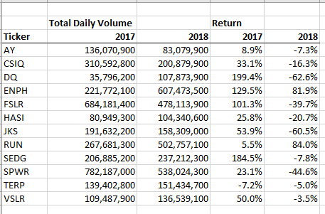 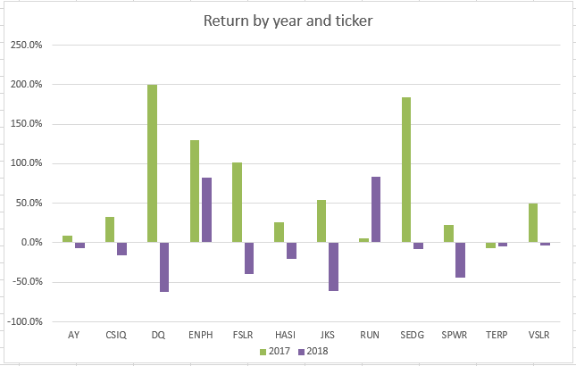

Looking at the daily closing prices by stock over 2017 and 2018 shows most of the stocks varied little over this period, generally trending neither up nor down. This suggests the portfolio as a whole generated little return over the course of the 2 years. Two notable exceptions are the stocks SEDG and DQ which show a significant run up in price and then a decline. SEDG does close 2018 showing a significant increase in stock price, while DQ closes 2018 approximately where it began in 2017.

Steve should look at whether the market as a whole, or particular indices/segments of the market performed better than this portfolio.

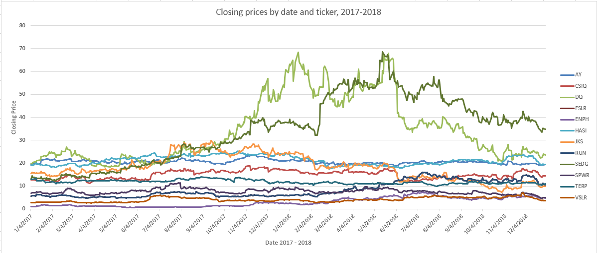

### Script Refactoring
The chart below shows the progress in refactoring the script to reduce run time by 90%. The greatest time savings was obtained by restructuring the data collection and processing algorithm to reduce the number of times all rows of data had to be read.

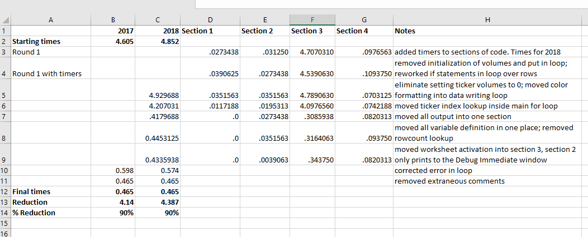

### Structure of the algorithm

#### The original algorithm

The original algorithm an be described in pseudocode:
    1) Get user input - year
        start timer
    2) Set up output worksheet
        activate Results worksheet and write headers
    3) Analyze stock data
        - create array of tickers (length 12)
        - create 3 arrays the same size as tickers, each to hold one of the three
          data elements collected in following analysis 
        - activate worksheet for the selected year
        - count the number of rows in worksheet (1 pass through all rows)
        - for each ticker in the array read through the entire worksheet (1 pass
          through all rows for each ticker)
            - activate year worksheet
            - for rows matching ticker, sum volumes, get closing price on first row,
              get closing price on last row
    4) Output results
        - activate Results worksheet
        - for each ticker write to a separate row
            - write ticker, total volume, return (calculated from start and ending
              prices)
        - format worksheet
            - activate Results worksheet
            - format headers and columns of data
            - colorcode variable return
                for each row, set green background for return>0, otherwise red
    End timer
    output runtime to screen
                     
(VBA module ChallengeStart contains the original code with some comments explaining the logic.)

This script does 13 passes through all rows of data. It also activates worksheets 16 times. 

The run times are 4.605 seconds for 2017 and 4.852 for 2018, as shown in the screenshots below. 

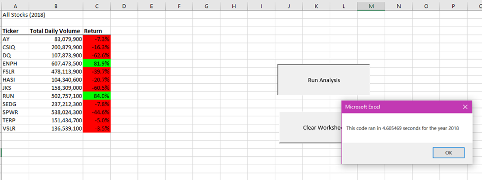 (3012 rows)

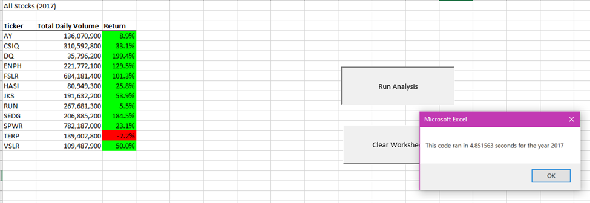 (3012 rows)

#### Strategies for reducing run time

##### Collect data on run times for independent sections of code

I divided the code into 4 independent sections and inserted code to output the run time of each section. Please see the chart below showing the starting run times, as well the run times for each section of code throughout the refactoring process. (I focused on 2018 for testing purposes.) 

The longest run time is for section 3, the "for loop" collecting the data for each ticker. The loop is constructed to process all rows for each of the 12 values in the ticker array. For 2018 that's 12 * 3,012 = 36,144 rows to be processed. This is the section of code that will provide the greatest savings.

Collecting independent sections of code by worksheet should allow savings from reducing the number of worksheet activations. Then the code can be optimized within each worksheet.

##### Combine independent sections of code by worksheet
All of the code formatting the Results worksheet can be combined with the code writing the output. The revised code only writes to the results worksheet after all the data has been collected. Cell formatting is done as each row is written rather than formatting in a separate loop. 

Original Output Code:

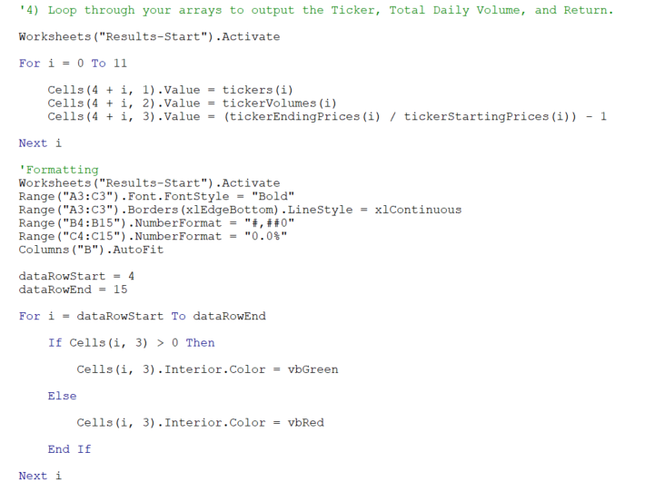

Refactored Output Code:

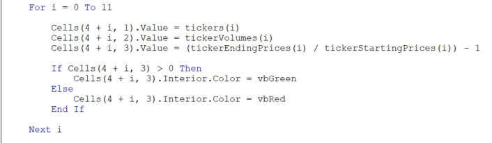

The code processing the data can be refactored to do all processing in one pass through the year worksheet. This is possible because the rows have already been sorted by ticker and date. It is also possible to eliminate the need to count the number of rows before entering the loop by switching to "Do Until" the next row is empty. 

Original Code:

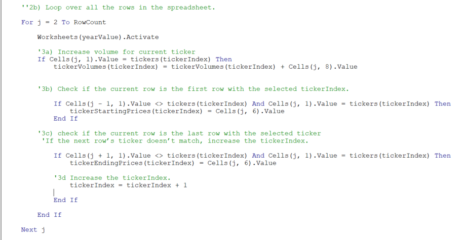

Refactored Code:

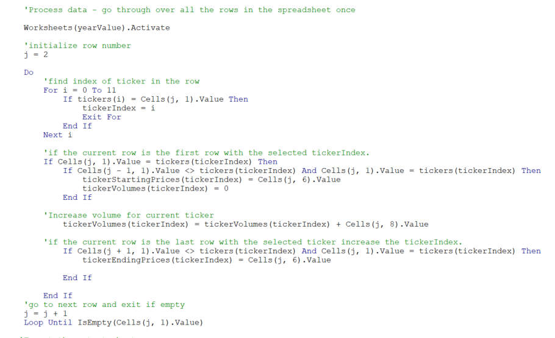

The refactored code run times are displayed in the following screenshots. There was a 90% savings for 2017 and 90% for 2018.

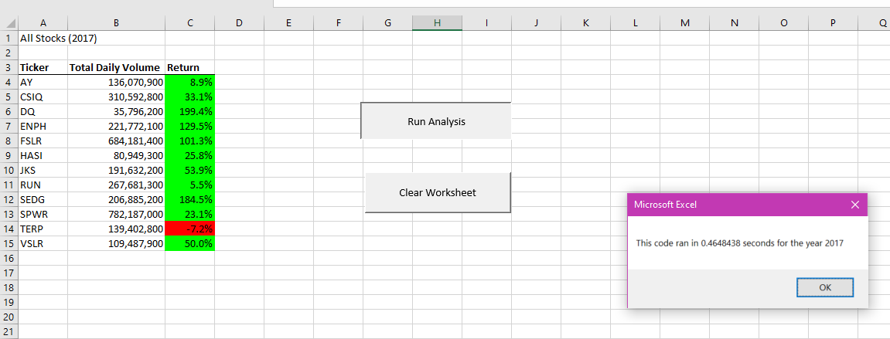

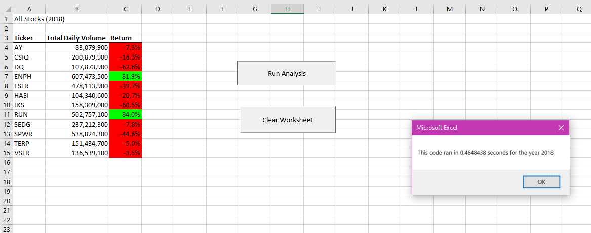

## Summary

Generally, refactoring code can be done to improve efficiency, readability and maintenance. Efficiency in the use of memory and speed lessen the pressure to upgrade and/or add hardware. Improvement in readability makes it easier for subsequent programmers to pick up and modify or enhance code. This is particularly important when there is turnover in staff, or as is currently happening, a large percentage of programmers who built legacy systems are retiring, taking with them valuable knowledge and expertise. 

One disadvantage I see is the temptation to improve efficiency at the expense of flexibility. Flexibility in the code makes it easier to accommodate changes in the input and to reuse code for other projects. A highly optimized algorithm may be based on assumptions about the input data. Changes to the input can result in the need to rework the code.

Our assignment to refactor the stock analysis code showed how some simple changes in logic can produce dramatic improvements in processing time. A 90% savings in time on our small dataset translated into only a few seconds. A improvement hardly worth noting, but a 90% improvement when processing data for the entire NYSE or NASDAQ would be a very valuable achievement.

One reason it was easy to make the logic changes I used, is the data was already sorted by ticker and date, and the ticker symbols were already known. If the data unexpectedly came in sorted differently, or with different stocks, or differing dates for each stock, the program would not work. The balance between speed and flexibility has to be considered when taking on a refactoring project.