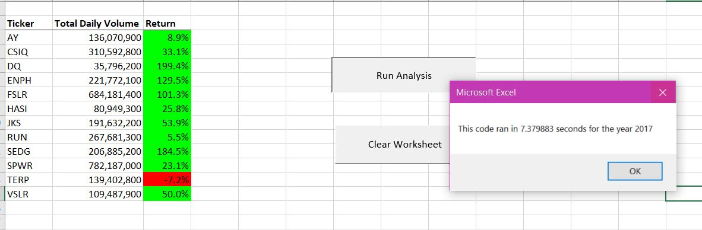
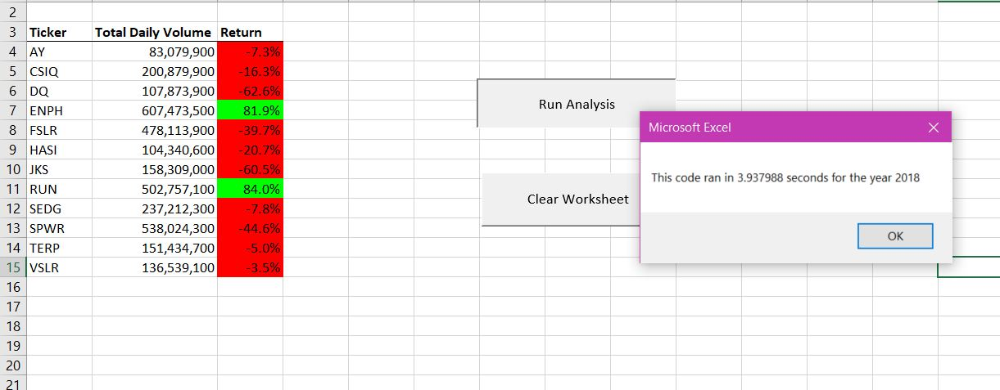
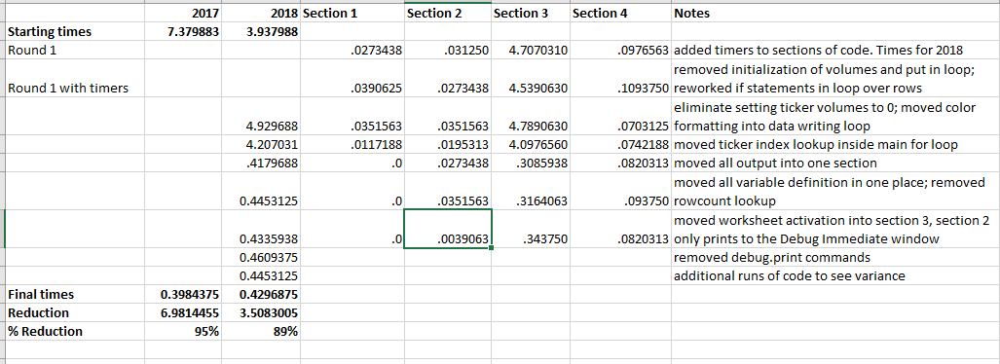
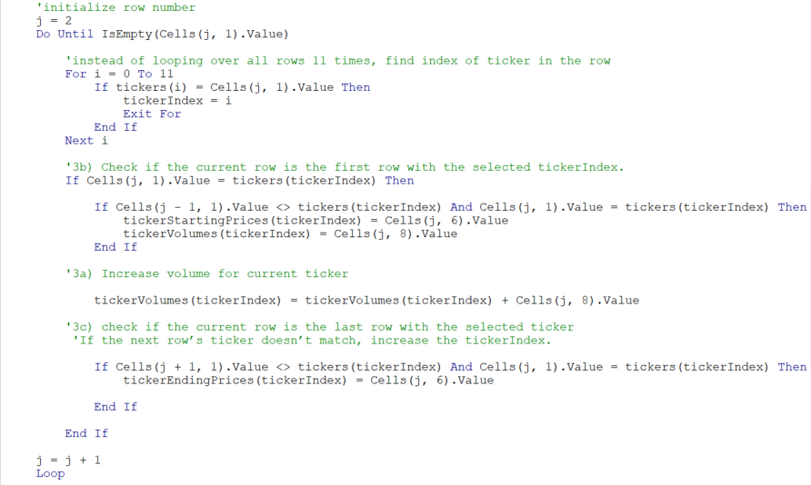
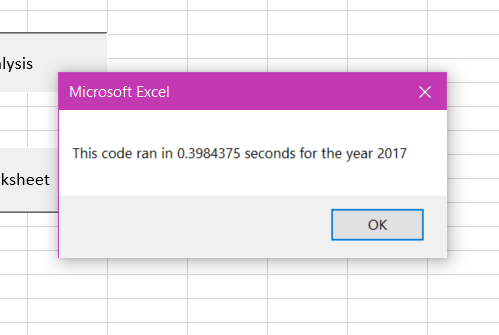
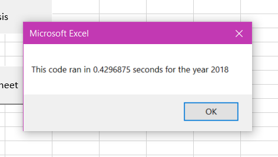

# VBA Challenge
## Overview of Project

Refactor the existing solution to increase the speed of execution and handle large datasets in a reasonable time. Assess whether the refactored code is significantly faster.

## Results
Using images and examples of your code, ***compare the stock performance between 2017 and 2018***, as well as the execution times of the original script and the refactored script.

### Structure of the algorithm

#### The original algorithm

Module ChallengeStart contains the starting code with some comments explaining the logic. The starting run times are 7.38 for 2017 and 3.94 for 2018, as shown in the screenshots below. 

I divided the code into 4 logical sections and inserted code to output the run time of each section. Please see the chart below showing the starting run times, as well the run times for each section of code throughout the refactoring process. (I focused on 2018 for testing purposes.) 

The longest run time is for section 3, the for loop collecting the data for each ticker. The loop is constructed to process all rows for each of the 12 values in the ticker array. For 2018 that's 12 * 3,012 = 36,144 rows to be processed. This is the section of code that will provide the greatest savings.

#### Strategies for reducing run time

Restructuring the code to process all rows just once provides significant improvement in run time. This is possible because the rows have already been sorted by ticker and date. It is also possible to eliminate the need to count the number of rows before entering the loop by switching to "Do Until" the next row is blank. 

Original Code:

Refactored Code:

Additional run time improvements are gained by reducing the number of times the code switches between worksheets. The revised code only writes to the results worksheet after all the data has been collected. Cell formatting is done as each row is written rather than formatting in a separate loop. 

The refactored code run times are displayed in the following screenshots. There was a 95% savings for 2017 and 89% for 2018.

## Summary
What are the advantages or disadvantages of refactoring code?
How do these pros and cons apply to refactoring the original VBA script?